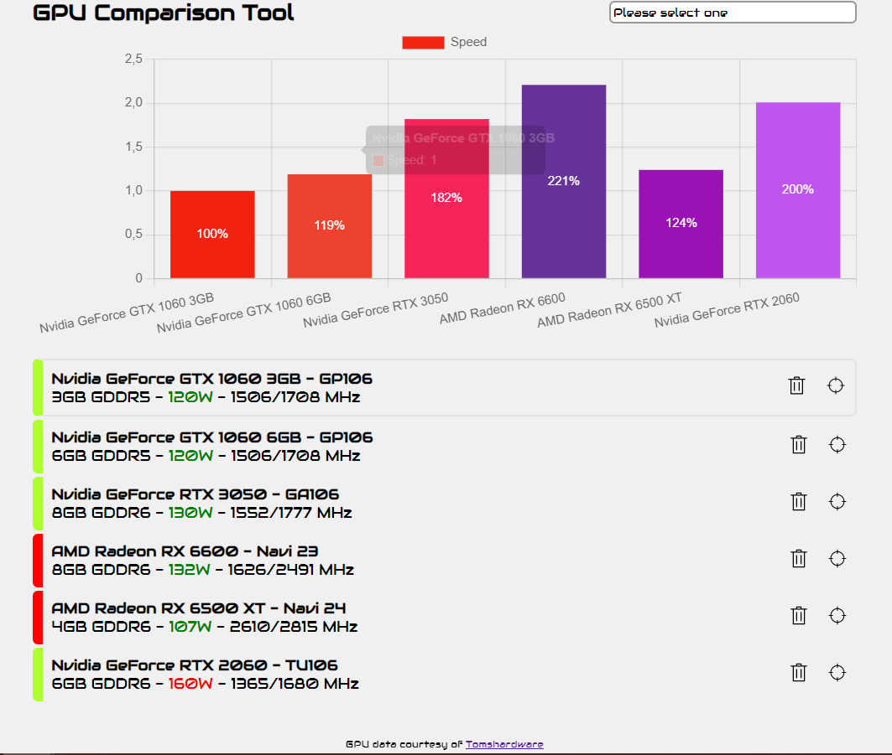

# GPU Comparison tool

Quick project to scrape a page and build a simple web tool to visualise the acquired data. I wanted to easily compare the speed of different generations of GPUS and have the chance to set a specific GPU as base reference for comparison.

GPU data courtesy of [Tomshardware](https://www.tomshardware.com/reviews/gpu-hierarchy)

SVG Icons courtesy of [SVG Icons](https://svgicons.sparkk.fr).

## Features

- [x] Web scraping with [cheerio](https://cheerio.js.org/) to fetch GPU data
- [x] SPA in a single .html with no build system thanks to [petite-vue](https://github.com/vuejs/petite-vue)
- [x] bar chart with [chartjs](https://www.chartjs.org)

## Todos

- [ ] Line Chart with GPU's prices

# Demo

[Check the app online](https://gpu-comparison-2022.netlify.app/) or test things locally by just installing dependancies with `npm i`.

## Bugs

Uhm, please let me know...!

## License

This project is licensed under the ISC License.
